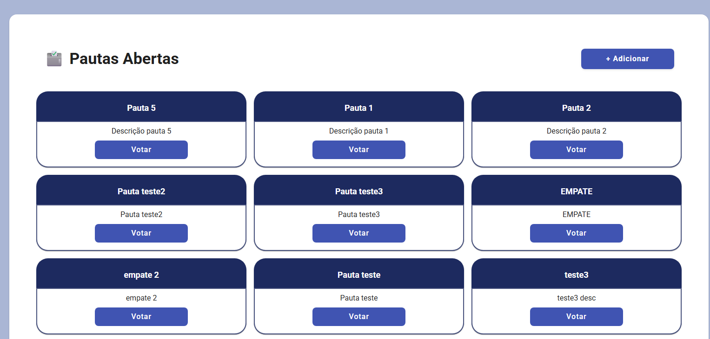
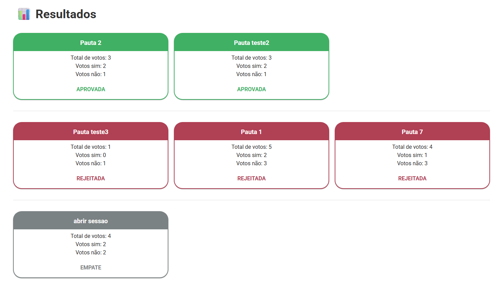
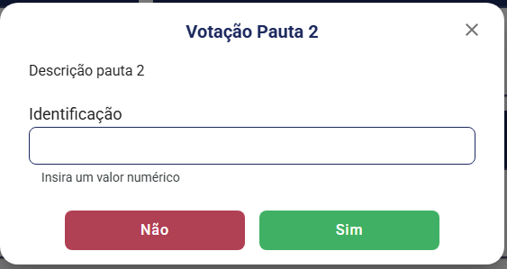

# 🗳️ Sistema de Votação para Cooperativas

Este projeto é uma aplicação completa de votação digital para cooperativas, com funcionalidades para criação de pautas, abertura de sessões de votação com tempo definido ou padrão, registro de votos únicos por associado e exibição do resultado da votação.

### Link para acessar o projeto: https://votacao-tau.vercel.app/

---

## ⚙️ Tecnologias Utilizadas

### 🔙 Backend

- **Java 17**
- **Spring Boot**
- **Arquitetura Hexagonal (Ports and Adapters)**
- **Banco de Dados PostgreSQL** (hospedado no [Railway](https://railway.app))
- **Hospedado no [Render](https://render.com)** com suporte a Docker (imagem criada via `Dockerfile`)
- **Swagger/OpenAPI** para documentação da API: [Swagger da api](https://spring-boot-backend-bzbf.onrender.com/swagger-ui/index.html)
- **JPA/Hibernate** para persistência

### 🌐 Frontend

- **React + Vite**
- **TypeScript**
- **Material UI (MUI)** para UI responsiva e moderna
- **Axios** para consumo de API

---

## 📐 Arquitetura Hexagonal

Este projeto segue os princípios da **Arquitetura Hexagonal** (também conhecida como **Ports and Adapters**) combinada com práticas do **DDD** e da **Clean Architecture**, garantindo:

- 🧠 **Clareza semântica**: fica evidente o que é **entrada**, **saída**, **domínio** e **aplicação**.
- 🧱 **Separação de responsabilidades** bem delimitada.
- 🧪 **Facilidade de testes, manutenção e evolução** do sistema.

### 📂 Organização do Código

```plaintext
src/
├── application/          # Casos de uso da aplicação
├── domain/                # Entidades, enums, regras de negócio
├── infrastructure/      # Repositórios, integrações, controllers
└── config/                 # Configurações gerais (CORS, Swagger, Beans)
```

---

## 🔍 Escolhas Técnicas

- **Spring Boot** pela robustez, produtividade e comunidade
- **Arquitetura Hexagonal** para facilitar testes e trocas tecnológicas futuras
- **Vite** no frontend por ser mais rápido e leve que alternativas como CRA
- **Material UI** pela consistência visual e integração com React
- **Railway** para banco de dados PostgreSQL por simplicidade e deploy rápido
- **Render** para hospedar o backend via Docker, com bom suporte a autoscaling

---

## ✅ Funcionalidades

- 📄 **Cadastrar uma nova pauta**
- 🕒 **Abrir uma sessão de votação**
- 🗳️ **Receber votos** dos associados (Sim/Não)
  - Cada associado é identificado por um ID único
  - Cada associado pode votar **apenas uma vez por pauta**
- 📊 **Contabilizar os votos e retornar o resultado** de cada pauta

---

## 📦 Como Rodar o Projeto Localmente

### 🧱 Backend

### 📌 Requisitos para rodar:

- Java 17
- Maven 3.8+
- PostgreSQL 12+

### 1) Clonar o projeto

```bash
git clone https://github.com/aureasiqueira1/votacao.git
```

### 2) Entrar na pasta:

```bash
cd votacao/back
```

### 3) Rodar com Maven localmente:

```bash
./mvnw spring-boot:run
```

---

### 🌐 Frontend

- Requisitos: Node.js (18+)

### 1) Depois de clonar o projeto, entrar na pasta:

```bash
cd votacao/front
```

### 2) Instalar dependências:

```bash
npm install
```

### 3) Adicionar arquivo .env:

- Para usar api local:

```
VITE_API_BASE_URL="http://localhost:8080/api"
```

- Para usar api na nuvem:

```
VITE_API_BASE_URL="https://spring-boot-backend-bzbf.onrender.com/api"
```

### 4) Rodar aplicação:

```bash
npm run dev
```

---

### Demonstração:

<p align="center">
  
  <br />
  
  <br />
  
  <br />
  
  <br />
  
</p>
